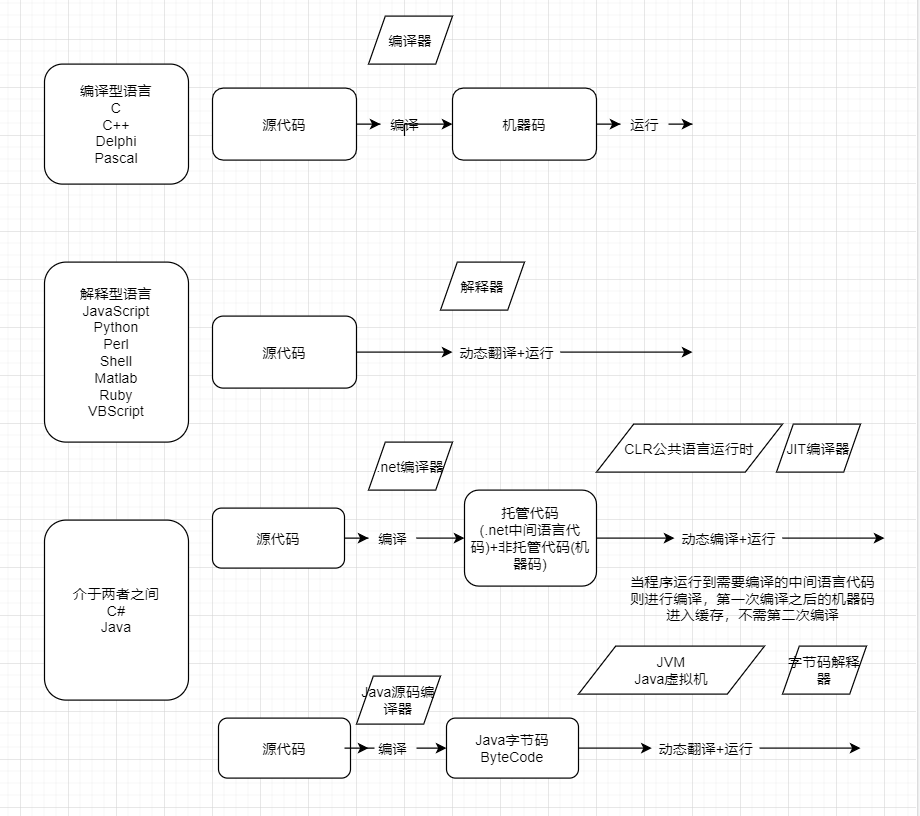
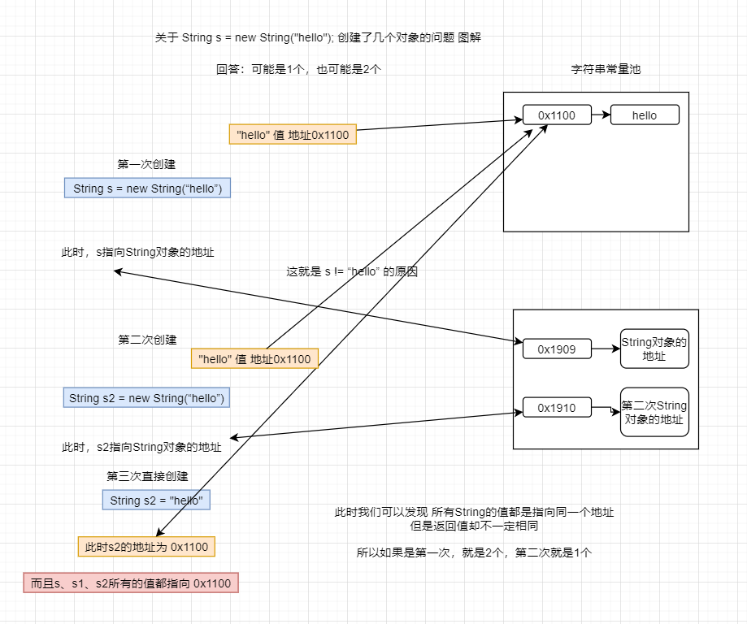
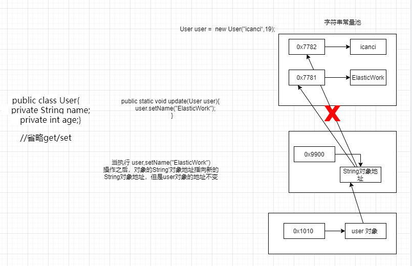
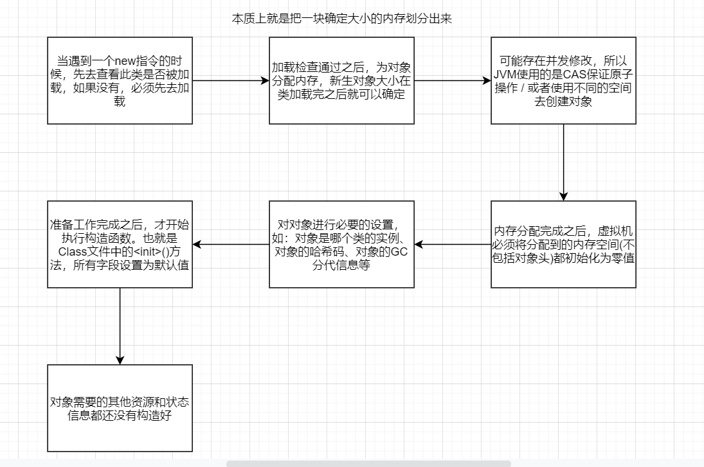

### JavaSE 基础

- Java语言的特点

```markdown
简单：风格类似C++，但是摒除了C++的指针和繁琐的内存管理，采用垃圾回收机制帮助管理内存。提供了丰富的类库。

面向对象：Java语言的设计是完全面向对象的，支持静态和动态风格的代码继承和重用。

分布式：Java是一个支持HTTP/FTP/TCP/IP协议的语言，它有一个专门的子库。

健壮：Java是强类型语言，而且在编译和运行期间会对程序进行检查，可以规避早期开发的一些错误。Java自己操作内存，减少了内存出错的可能性，Java也可以自定义异常，协助更好的开发。

结构独立：Java被设计为跨平台，它的运行于机器无关，只要安装了Java虚拟机。就可以编译成任何机器都可以识别的Byte-code格式语言。

安全：一方面体现在指针和对象的释放，是通过GC完成的，不需要人为的操作。另一方面，Java用来创建浏览器的时候，语言本身是和浏览器本身的功能结合起来。而且Java文件在真正执行之前，会经过非常多的检查(这部分内容将在`Java面试知识宝典 - JVM.md`给出详细的解释)，从而保证程序的安全。

可移植的：可以移植的最大功臣就是JVM。她使得Java不必为同一个系统单独开发多套运行环境对应的代码。

解释型语言：Java解释器(运行系统)可以直接运行目标代码指令，链接程序比编译程序花的时间少。

高性能：Java的速度很快，只是相对于C/C++稍微逊色一点点，但是对于Java的强大来说，这点性能损耗微不足道。(曾有传言Java慢，那只是Java的最初版本，那个时候JVM还没有很强大，Java语言尚未成熟，现在Java一点都不慢)

多线程：Java天然支持多线程，这就保证了你在同一时间，可以做多个事情。

动态：Java的类加载机制(这部分内容将在`Java面试知识宝典 - JVM.md`给出详细的解释)，保证类的加载，但是不是一次性加载所有的类，除了那些运行必须的类，其他的是用到了才加载。

Unicode：天生使用Unicode编码，这项特性使得Java的程序能在不同语言的平台上都能撰写和执行。并不会因为编码而导致Java程序不能运行。

跨平台：Java是跨平台，基于Java虚拟机实现的跨平台语言。Java文件编译之后的字节码文件`.class`是跨平台的，号称`一次编译，到处运行`。其实JVM不是跨平台的，跨平台的原理是字节码被JVM翻译成各个平台识别的二进制文件。
```

- JDK、JRE、JVM的关系是什么，全称是什么，作用是什么

```markdown
JDK：Java Development Kit 是整个Java的核心，包括了JRE，Java工具包(javac/java/) 包含了开发环境，总的来说JDK是用于java程序的开发,而jre则是只能运行class而没有编译的功能。

JRE：Java Runtime Environment Java运行环境，包含JVM的基本实现和核心类库，JRE是一个运行环境，而不是开发环境。编写的程序必须有JRE才能运行。

JVM：Java Virtual Machine Java虚拟机 是Java跨平台的核心 Java虚拟机在执行字节码时，把字节码解释成具体平台上的机器指令执行。JVM执行.class文件 还需要JRE下的lib类库的支持，尤其是rt.jar(Runtime的缩写)

联系：JDK包含JRE，JRE包含JVM。前者可以做后者所有的事情，反之不可以。
```

- 什么是字节码？使用字节码的好处？Java跨平台的原理？字节码怎么生成的？

```markdown
字节码：Java文件被JVM虚拟机编译之后生成的 .class 文件，其中包含所有的Java文件信息，但是不包含注释。

字节码的好处：所有的Java文件都会被编译成 .class文件，而 .class文件可以被任何安装有JRE的机器执行，翻译成机器看得懂的二进制文件执行。

Java跨平台的原理：Java文件不是跨平台的，但是JVM是跨平台的，不同的机器安装不同的JRE，就可以运行任何 .class文件，也就是说，同一份字节码在不同的机器上，解释运行的结果是完全一样的。

字节码的生成：(此部分涉及到Java的类加载，本文暂时不讲解)
全过程概述如下：
(1) Java文件分析和输入到符号表
(2) 注释处理
(3) 语义分析和生成class文件
最后生成的class文件由以下部分组成
(1) 结构信息。包括class文件格式、版本号以及各部分的数量和大小等信息
(2) 元数据。对应于Java源码中声明于常量的信息。包含类/继承的超类/实现的接口的声明的信息、域与方法声明信息和常量池
(3) 方法信息。对应Java源码中语义和表达式对应的信息。包含字节码、异常处理表、求值栈与局部变量区的大小
求值栈的类型记录，调试符号信息
```

- Oracle JDK 和OpenJDK的对比

```markdown
Oracle JDK 和 Open JDK只在部分没有版权部分有差异，其他部分几乎完全一样。
```

- Java和其他语言的对比




- 什么是Java程序的主类

```markdown
一个程序中可以有多个类，但只能有一个类是主类
在Java应用程序中，整个主类指的是包含 main() 方法的类。主类是Java程序的入口点
在Java小程序中，这个主类是一个继承自系统类JApplet或者Applet的子类

应用程序的主类不一定是public类，但是小程序的主类必须是public类
简单说应用程序是从主线程启动(也就是 main() 方法)。applet 小程序没有 main() 方法，主要是嵌在浏览器页面上运行(调用init()或者run()来启动)，嵌入浏览器这点跟 flash 的小游戏类似。
```

- 为什么说Java语言”编译和解释并存“

```markd
因为Java文件时先编译称class字节码文件，然后再由JVM解释执行。
```

- 字符型常量和字符串常量的区别

  ```markdown
  形式上：字符常量是单引号引起的一个字符例：'a'
  字符串常量是双引号引起的若干个字符"helloworld"
  
  含义上：字符常量相当于一个整形值（ASC||值），可以参加表达式运算，直接拿变量使用
  字符串常量代表一个地址值（该字符在内存中存放的位置）
  
  占内存大小：
  字符常量只占一个字节
  字符串常量占若干个字节
  字符型常量使用char型变量来存储
  字符串用char型的数组来存储
  
  类型字符类型为char，字符串类型为string
  两者都是常量，区别于使用方法的不同
  ```

  - 字符串类型的底层是什么？

  ```markdown
  字符串类型的底层是char类型数组 `private final char value[];` 
  但是在JDK9之后修改外byte数组`private final byte[] value;`
  因为使用的是final修饰，所以String是不可变的
  ```

  - String类型可以继承吗？

  ```markdown
  不可以继承，因为
  `public final class String
      implements java.io.Serializable, Comparable<String>, CharSequence {}`
  这个类使用final修饰的
  ```

  - `String s = "hello",s = s+"world";` 这段代码执行之后，原始的String类型变类没有？为什么？

  ```markdown
  没有改变，具体的请看下面这张图即可。
  ```

  

  - 请你谈一谈final关键字？

  ```markdown
  final可以有用来修饰类、方法和变量(包括成员变量和局部变量)
  
  修饰类：表示这个类是终类，不可以被继承。注意：final类中的所有成员方法都会被饮食指定为final方法
  在使用final修饰类的时候，要注意谨慎选择，除非这个类真的在以后不会用来继承或者出于安全的考虑，尽量不要将类设计为final类。
  
  修饰方法：下面这段话摘自《Java编程思想》第四版第143页：
  "使用final方法的原因有两个。第一个原因是把方法锁定，以防任何继承类修改它的含义；第二个原因是效率。在早期的Java实现版本中，会将final方法转为内嵌调用。但是如果方法过于庞大，可能看不到内嵌调用带来的任何性能提升。在最近的Java版本中，不需要使用final方法进行这些优化了。"
  因此，如果只有在想明确禁止 该方法在子类中被覆盖的情况下才将方法设置为final的。
  注：类的private方法会隐式地被指定为final方法。
  
  修饰变量：对于一个final变量，如果是基本数据类型的变量，则其数值一旦在初始化之后便不能更改；如果是引用类型的变量，则在对其初始化之后便不能再让其指向另一个对象。
  ```

  - String、StringBuffer、StringBuilder的联系和区别

    ```markdown
    String是不可变的，String底层的连接，是使用的 StringBuilder的append方法实现
    StringBuffer和StringBuilder都是继承了 `AbstractStringBuilder`
    StringBuffer和StringBuilder的API大致一样，只不过StringBuffer是线程安全的，因为方法使用了`synchronized`关键字修饰，而StringBuilder没有。
    ```

    - 什么时候用“+”元算符进行字符串连接比调用“StringBuilder/StringBuffer”的append方法连接字符串性能更好

      ```markdown
      因为String底层的拼接操作使用的是StringBuilder的append()方法，所以对于速度，就取决于Stirng字符串拼接的速度和创建StringBuilder的速度并且返回tString()方法的速度相比。
      ```

- 了解自增和自减吗？
  - i++是线程安全的吗？为什么?

    ```markdown
    i++ 不是线程安全的
    因为i++不是一个原子操作，i++有三个操作
    
    内存到寄存器 读取 i 的值到寄存器
    寄存器自增   寄存器执行 i = i + 1; 将之前的值放到一个临时变量区
    寄存器回内存 然后返回临时变量的值。返回值是临时变量区的值，但是i完成了自增
    
    从这三个阶段来看，不是线程安全的，因为分为了三个阶段来完成这一个事情。
    ```

  - 如何实现线程安全？还有没有更好的方法？

    ```markdown
    方法1：使用 Synchronized 关键字对操作的部分进行加锁
    方法2：使用Java中的原子类
    ```

  - 了解Java中的原子类吗？你在工作中或者项目中用到过原子类吗？(部分在这里做简单介绍，将在 `Java面试宝典 - 多线程.md` 彻底刨析讲解)
    - 原子类是怎么实现的？
    
      ```java
      // 使用CAS算法实现，用到了一个核心类 `UnSafe` 此处暂时不展开讲解，知道这个概念即可，将在 Java面试宝典 - 多线程.md 彻底刨析讲解
      
      public final int getAndIncrement() {
          return U.getAndAddInt(this, VALUE, 1);
      }
      
      @HotSpotIntrinsicCandidate
      public final int getAndAddInt(Object o, long offset, int delta) {
          int v;
          do {
              v = getIntVolatile(o, offset);
          } while (!weakCompareAndSetInt(o, offset, v, v + delta));
          return v;
      }
      ```
    
    - 如果你自己实现原子类？你会怎么做？
    
    ```markdown
    方法1：synchronized 锁
    方法2：CAS
    方法3：CAS + 版本控制
    ```
    
    - 知道CAS吗？CAS的底层原理是什么？CAS的缺点知道吗？
    
    ```markdown
    synchronized是悲观锁。使用 Synchronized访问的线程一旦得到锁，其他需要锁的线程就挂起的情况就是悲观锁。
    CAS是乐观锁，每次不加锁而是假设没有冲突而去完成某项操作，如果因为冲突失败就重试，直到成功为止。
    
    CAS是英文单词Compare And Swap的缩写，翻译过来就是比较并替换。
    CAS机制中使用到了3个基本操作数：内存底池V、旧的预期值A、要修改的新值B
    更新一个操作的时候，只有当预期的值A和内存地址中的V的实际值相等的时候，才会将内存地址V的值修改为B
    
    CAS的缺点：
    (1) CPU开销较大
    在并发量比较高的情况下，如果许多线程反复尝试更新某一个变量，却又一直更新不成功，循环往复，会给CPU带来很大的压力。
    
    (2) 不能保证代码块的原子性
    CAS机制所保证的只是一个变量的原子性操作，而不能保证整个代码块的原子性。比如需要保证3个变量共同进行原子性的更新，就不得不使用Synchronized了。
    ```
    
    - 谈谈你对UnSafe的理解
    
    ```markdown
    UnSafe是Java提供的的一个保证CAS原子性的类
    使用了大量的本地方法，所以器CAS的UnSafe类是基于C/C++实现的，C/C++可以直接操作内存地址的值，进而直接保证原子操作
    (此部分在`Java面试宝典 - 读线程.md` 部分进行讲解)
    ```
    
    - 为啥AtomicInteger使用CAS而不是synchronized
    
    ```markdown
    CAS是一直重试，但是synchronized是直接锁定，CAS相对于synchronized来说比较轻松一点，但是CAS回导致很多次循环比较的问题
    
    synchronized采用的是悲观锁，是一种独占锁，独占锁就意味着 其他线程只能依靠阻塞[就是其他线程不停的询问]来等待线程释放锁。而在 CPU 转换线程阻塞时会引起线程上下文切换，当有很多线程竞争锁的时候，会引起 CPU 频繁的上下文切换导致效率很低
    CAS采用的是一种乐观锁的机制，它不会阻塞任何线程，所以在效率上，它会比 synchronized 要高。
    ```
    
    - 知道ABA问题吗？
      
      ```markdown
      ABA问题出现在CAS乐观锁中，假如数据原本是A经过某些操作之后，变成了B，然后又经过某些操作，从B变成了A，那么CAS会判定`A=A`没有发生改变，但是此时已经发生过改变，这就是ABA问题。
      ```
      
      - 怎么规避ABA问题
      
      ```markdown
      可以使用版本号来进行控制(类似时间戳)、
      
      假设A线程从主内存中拿到值为100 版本号为1，B线程也从主内存中拿到了值为100版本号为1，这时A线程挂起，B线程将值修改成了50，但是版本号要跟着修改成2，然后又进行了一次修改将50又改会了100，版本号3，这时B线程结束A线程启动，看到值为100，进行修改得到150但是版本号为2，低于当前版本号3，所以这次操作作废，需要重新去读取主内存中的值。
      ```
      
    - 原子引用更新的原理是什么
    
    ```markdown
    AtomicReference：用于对引用的原子更新
    AtomicMarkableReference：带版本戳的原子引用类型，版本戳为boolean类型。
    AtomicStampedReference：带版本戳的原子引用类型，版本戳为int类型。
    
    就是对CAS添加了版本控制
    ```
    
  - 那你知道JMM吗？
    
    ```markdown
    JMM全称Java Memory Model Java内存模型
    如下图：(图片来源：https://blog.csdn.net/suifeng3051/article/details/52611310)
    1. 首先，线程A把本地内存A中更新过的共享变量刷新到主内存中去。
    2. 然后，线程B到主内存中去读取线程A之前已更新过的共享变量。 
    
    这种模型导致了线程不安全的问题
    ```

  

  - 那你知道volatile关键字吗？
    
    - volatile关键字有哪些特性
    
    ```markdown
    volatile关键字有三个特性
    
    保证JMM内存可见性
    不保证原子性
    禁止指令重排序
    ```
    
    - volatile和synchronized的区别知道吗？
    
    ```markdown
    volatile不能保证原子性，synchronized可以保证原子性
    volatile相当于是个轻量级的锁，synchronized是重量级锁
    ```
    
    - 知道单例设计模式吗？(设计模式部分将在 `设计模式` 单独讲解)
      - 如何设计单例模式，你有几种方法？
      
      ```markdown
      (1) 懒汉式
      (2) 饿汉式
      (3) 静态内部类
      (4) 双重检查锁
      (5) 使用枚举实现
      ```
      
      - 单理模式中的饿汉式之双重检查锁一定是线程安全的吗？怎么解决
      
      ```java
      // 不一定，在极高并发场景下，也会出现线程不安全的问题
      
      // 双重检查锁版本1
      public class Singleton {
          private static Singleton instance;
      
          private Singleton() {
          }
      
          public synchronized Singleton getInstance() {
              if (null == instance) {
                  if (null == instance) {
                      instance = new Singleton();
                  }
              }
              return instance;
          }
      }
      
      // 双重检查锁版本2
      public class Singleton {
          private static Singleton instance;
      
          private Singleton() {
          }
      
          public Singleton getInstance() {
              if (null == instance) {
                  synchronized (Singleton.class) {
                      if (null == instance) {
                          instance = new Singleton();
                      }
                  }
              }
              return instance;
          }
      }
      
      // 双重检查锁终极版本
      public class Singleton {
          private volatile static Singleton instance;
      
          private Singleton() {
          }
      
          public Singleton getInstance() {
              if (null == instance) {
                  synchronized (Singleton.class) {
                      if (null == instance) {
                          instance = new Singleton();
                      }
                  }
              }
              return instance;
          }
      }
      
      ```
      
    - 你使用过volatile关键字吗？
      
      - 为什么要使用volatile关键字
      
      ```markdown
      上述的单例模式为什么需要加volatile呢?
      volatile就牵扯到指令重排序的问题了
      
      new一个对象有几个步骤。
      
      (1) 看class对象是否加载，如果没有就先加载class对象，
      (2) 分配内存空间，初始化实例，
      (3) 调用构造函数，
      (4) 返回地址给引用。
      
      而cpu为了优化程序，可能会进行指令重排序，打乱这(3)、(4)这几个步骤，导致实例内存还没分配，就被使用了。所以需要使用volatile禁止指令重排序
      ```
      
    - 知道volatile关键字的底层实现吗？(将在 `Java面试宝典 - 多线程.md` 彻底刨析讲解)
    
    ```markdown
    volatile的底层是通过lock前缀指令、内存屏障来实现的。 
    ```

- continue、break和return的区别是是什么？

```markdown
cintinue：跳过当前执行
break：退出当前执行
return：退出当前方法
```

- Java泛型知道吗？什么是类型擦除？介绍一下常用的通配符？

```markdown
Java在1.5开始支持泛型
其拥有更好的安全性和更好的可读性

泛型擦除：在编译时期，JVM会把泛型全部擦除，将其转换为具体的类型

常用的通配符
泛型的通配符
(1) <T extends E>写法仅限于用于定义类型参数，申明了一个类型参数T(使用的时候必须指定泛型类型)
(2) <? extends E>用于实例化类型参数，可以用于实例化泛型变量中的类型参数，只是当前类型可以是未知的，只需要知道范围上限，即属于泛型E的子类即可(使用的时候可以不指定泛型类型，或者直接传递子类类型即可)

无限定通配符
(1) 无限定通配符能修饰的泛型，都可以使用泛型类型参数的方式替换
(2) 通配符可以减少泛型类型参数，代码更简洁，可读性更好
(3) 如果类型参数之间有依赖关系，或者返回值依赖于传递的类型参数，这里只能使用泛型类型参数

超类型通配符

总结:
1.三种通配符存在的意义都是为了使得java动态代码更加灵活，可以接受更广泛的类型
2.<? super E>通配符方式更适合灵活写入的场景，使得java编译器不会捕捉子类型写入父类型的容器的错误，并且不能被泛型参数类型的方式替换
3.<?>和<? extends E>方式更适合用于灵活的读取，使得代码可以读取E和任何子类的对象，这里的通配符操作和泛型类型参数操作完全等同，可以互相替换

泛型部分来自以下文章：
作者：享学课堂
链接：https://www.jianshu.com/p/8434960df263
来源：简书
著作权归作者所有。商业转载请联系作者获得授权，非商业转载请注明出处。
```

- == 和 equals的区别

```markdown
== 比较的是内存地址
equals 比较的是地址的值
```

- hashCode()和equals()
  - hashCode()方法介绍

  ```markdown
  hashCode() 方法是为了计算当前对象的Hash地址
  以便为了进行Hash散列
  ```

  - 为什么要有hashCode()

  ```markdown
  在Java集合框架中，比如HashMap，对于元素的插入位置就是以靠计算Hash地址取模实现的
  如果没有Hash地址，那么元素放置的位置就会无法知晓
  ```

  - 为什么重写hashCode()必须要重写equals()方法

  ```markdown
  假如没有重写equals方法，那么两个不同的对象，计算出来同一个值，假如把这个值放在HashSet中去，会先找到对应的Hash地址，如果没有这个Hash地址，就直接插入到这个位置，但是如果有了，就会再使用 equals方法比较值是否相等。也就是说，两个对象的hashCode值相等并且equals()方法返回true，才会被认定是同一个对象。如果不重写的话，会导致计算比较查找不准确。
  ```

  - 为什么两个对象有相同的hashCode值，他们也不一定是相等的

  ```markdown
  因为两个对象的Hash值相等，表明两个对象经过Hash寻址计算之后得到的位置相等，这个也成为Hash冲突。假如要存放的位置只有10个，但是需要插入11个元素，那么经过Hash计算之后，一定有一个位置是放2个的，那么此时，这两个对象有相同的hashCode值，但是却不相等
  ```

- Java中的基本数据类型？对应的包装类？为什么要有包装类？占用多少字节？

  ```markdown
  byte 8位  Byte
  char 16位 Character
  short 16位 Short
  int 32位 Integer
  long 642位 Long
  float 32位 Float
  double 62位 Double
  boolean false/true Boolean
  
  记忆：8位：Byte（字节型）          
  16位：short（短整型）、char（字符型）          
  32位：int（整型）、float（单精度型/浮点型）          
  64位：long（长整型）、double（双精度型）          
  最后一个：boolean(布尔类型)
  ```

  - 了解自动拆箱和装箱机制吗？

  ```markdown
  自动拆箱和自动装箱，实在哎JDK1.5开始的，为了解决基本类型的对象问题。
  如：A今天参加考试，但是缺考了一门。那么他应该是多少分？0分不合适，人家没考怎么能给个0分？给个-1分？
  更不合适，所以这个时候，就应该给个标记，是缺考的，那么包装类型出现，此时A的分数栏应该填写 null
  ```

  - `short s1 = 1;s1 = s1+1;`有错吗？为什么？`s1+=1`有错吗？为什么？

  ```markdown
  `short s1 = 1;s1 = s1+1;`编译失败，因为1是int类型，s1是short类型，大范围类型转小范围类型必须强制转型
  `s1+=1;` 没有错，因为底层会对其进行强制类型转换
  ```

  - 知道常量池吗？
    - 为什么需要常量池？
    
    ```markdown
    为了减少使用空间，达到复用的效果，避免创建过多的重复数据元素以浪费空间
    ```
    
    - 常量池的设计模式知道吗？
    
    ```markdown
    Integer 有一个常量池，范围在 [-128 ~ 127]
    使用到的设计模式叫做：享元设计模式
    顾名思义：共享元素
    ```

- 什么是方法的返回值？返回值在类的方法的作用是什么？

  ```markdown
  即使方法结束时候是否返回一个数据，是为了得到一些处理过后的数据
  ```

  - 为什么Java中只有值传递

  ```java
  // 对于Java中是否有值传递和引用传递，争议很多。但是这里笔者人为Java中只有值传递，地址的值也是值，基本数据类型的值也是值。都可以作为`值`的名字存在 下面给出简单的代码实例
  
  public class Test1 {
      public static void main(String[] args) {
          System.out.println("-----------testArr------------");
          int[] arr = {1, 2, 3, 4, 5};
          System.out.println(Arrays.toString(arr));
          testArr(arr, 1, 100);
          System.out.println("--------------------------------");
          System.out.println(Arrays.toString(arr));
          System.out.println("-----------testBase------------");
          int x = 199, y = 200;
          System.out.println("x:" + x + " y:" + y);
          testBase(x, y);
          System.out.println("x:" + x + " y:" + y);
          System.out.println("-----------testString------------");
          String str = "world";
          System.out.println(str);
          testString(str);
          System.out.println(str);
      }
  
      /**
       * 修改数组指定下标的值
       *
       * @param arr    数组
       * @param index  下标
       * @param target 目标值
       */
      public static void testArr(int[] arr, int index, int target) {
          // TODO 参数类型判断，省略
          arr[index] = target;
      }
  
  
      /**
       * 交换两个数的值
       *
       * @param x
       * @param y
       */
      public static void testBase(int x, int y) {
          // TODO 参数类型判断，省略
          x = x ^ y;
          y = x ^ y;
          x = x ^ y;
          System.out.println("方法内 x:" + x + " y:" + y);
      }
  
      /**
       * 测试String类型
       *
       * @param str
       */
      public static void testString(String str) {
          // TODO 参数类型判断，省略
          str = "hello";
      }
  }
  // 测试结果
  
  /**
   * -----------testArr------------
   * [1, 2, 3, 4, 5]
   * --------------------------------
   * [1, 100, 3, 4, 5]
   * -----------testBase------------
   * x:199 y:200
   * 方法内 x:200 y:199
   * x:199 y:200
   * -----------testString------------
   * world
   * world
   * 
   * Process finished with exit code 0
   */
  
  // 那么到底是什么原因呢? 
  // 对于数组来讲，传递的是地址值，也就是数组的头位指针值，操作数组会直接操作数组的内存地址的位置的值
  // 对于基本数据类型来讲，其会把基本数据类型的值拷贝一份放到方法的局部变量里然后传入方法
  // 对于对象类型String来讲，因为我们知道String底层使用final修饰的数组(JDK8之前是char数组，JDK9之后是byte数组) 它很特殊，也是传递的String类的拷贝到方法的局部变量然后传入方法
  // 其他非基本数据类型和String类型，都是传递对象的引用地址，因此可以直接修改对象的内容
  ```

  - 重载和重写的区别

  ```markdown
  重载：重载是在同一个类中，方法名相同，参数列表不同的一组方法。参数列表不同指的是参数类型列表不同
  重写：子类覆写父类非私有方法，并对其功能进行拓展
  ```

  - 为什么函数不能根据返回值类型来区分重载

  ```markdown
  因为不同的参数列表也可有相同的返回值类型，如:`int twoAdd(int a,int b);`和`int threeAdd(int a,int b,int c)`具有相同的返回值类型，那也是重载吗？这样的重载就没有意义了。
  ```

  - 深拷贝和浅拷贝的区别

  ```markdown
  浅拷贝是按位拷贝对象，它会创建一个新对象，这个对象有着原始对象属性值的一份精确拷贝。如果属性是基本类型，拷贝的就是基本类型的值；如果属性是内存地址（引用类型），拷贝的就是内存地址 ，因此如果其中一个对象改变了这个地址，就会影响到另一个对象。即默认拷贝构造函数只是对对象进行浅拷贝复制(逐个成员依次拷贝)，即只复制对象空间而不复制资源。
  
  浅拷贝会带来数据安全方面的隐患，例如我们只是想修改了 `对象1` 的 某个属性，但是`对象2`的这个属性也被修改了，因为它们都是指向的同一个地址。所以，此种情况下，我们需要用到深拷贝。
  深拷贝，在拷贝引用类型成员变量时，为引用类型的数据成员另辟了一个独立的内存空间，实现真正内容上的拷贝。
  (1) 对于基本数据类型的成员对象，因为基础数据类型是值传递的，所以是直接将属性值赋值给新的对象。基础类型的拷贝，其中一个对象修改该值，不会影响另外一个（和浅拷贝一样）。
  (2) 对于引用类型，比如数组或者类对象，深拷贝会新建一个对象空间，然后拷贝里面的内容，所以它们指向了不同的内存空间。改变其中一个，不会对另外一个也产生影响。
  (3) 对于有多层对象的，每个对象都需要实现 Cloneable 并重写 clone() 方法，进而实现了对象的串行层层拷贝。
  ```

  - 方法的四种类型

  ```markdown
  无参无返回值
  无参有返回值
  有参无返回值
  有参有返回值
  ```

  - 当一个对象作为参数传递到一个方法之后，此方法可以改变对象的属性？并返回变化后的结果，那么这里到底是值传递还是引用传递？请画图说明原理！

  

- 面向对象
  - 面向对象有哪些特征以及你对这些特征的理解

  ```markdown
  封装：就是类的私有化。将代码及处理数据绑定在一起的一种编程机制，该机制保证程序和数据不受外部干扰。
  继承：就是保留父类的属性，开扩新的东西。通过子类可以实现继承，子类继承父类的所有状态和行为，同时添加自身的状态和行为。
  多态：是允许将父对象设置成为和一个和多个它的子对象相等的技术。包括重载和重写。重载为编译时多态，重写是运行时多态。
  ```

  - 访问权限修饰符 public、private、protected、以及不写（默认）的区别

  ```markdown
  类的成员不写访问修饰时默认为default。默认对于同一个包中的其他类相当于公开（public），对于不是同一个包中的其他类相当于私有（private）。受保护（protected）对子类相当于公开，对不是同一包中的没有父子关系的类相当于私有。
  
  作用域    当前类    同包    子类    其他
  public    √        √       √     √
  protected √        √       √     x
  default   √        √       x     x
  private   √        x       x     x
  ```

  - 如何理解clone对象
    - 为什么需要用clone
    
    ```markdown
    Java中默认的"="赋值操作，其实是将一个引用复制过去了，二者指向的还是同一块内存
    如果需要一摸一样的对象(此处引用不一样，仅仅值一样)，就需要clone
    ```
    
    - new一个对象的过程和clone一个对象的过程
    
    ```markdown
    new 一个对象的过程看下图，具体的类加载和创建流程会在 `Java面试知识宝典 - JVM.md` 全面刨析
    
    clone在第一步和new相似，都是分配内存，调用clone方法时，分配的内存和原对象(即调用clone方法的对象)相同，然后再使用原对象中对应的各个域，填充新对象的域，填充完成后，clone方法返回，一个新的对象被创建，同样可以把这个新对象的引用发布到外部。
    ```
    
    
    
    - clone对象的使用
    
    ```markdown
    需要实现Cloneable接口 这是一个标记接口
    
    /** 
     * A class implements the Cloneable interface to indicate to the {@link java.lang.Object#clone()} method that  
     * it is legal for that method to make a field-for-field copy of instances of that class. 
    */  
    public interface Cloneable {  
    }
    ```
    
    - 深拷贝和浅拷贝，请谈一谈实现的方法
    
    ```markdown
    浅拷贝，重写clone方法即可。
    深拷贝可以使用序列化实现，将对象保存到本地文件，然后读取文件在反序列化为对象。
    ```
    
  - 面向对象和面向过程的区别

  ```markdown
  (1) 出发点不同
  面向对象方法是用符合常规思维的方式来处理客观世界的问题，强调把问题域的要领直接映射到对象之间的接口上。而面向过程的方法则强调的则是过程的抽象化与模块化，它是以过程为中心构造或处理客观世界问题的。
  
  (2) 层次逻辑关系不同
  面向对象的方法则是用计算机逻辑来模拟客观世界中的物理存在的，以对象的集合类作为处理问题的单位，尽可能地使计算机世界向客观世界靠拢，以使问题的处理更清晰直接，面向对象方法是用类的层次结构来体现类之间的继承与发展。面向过程方法处理问题的基本单位是能清晰准确地表达过程的模块，用模块的层次结构概括模块或模块间的关系与功能，把客观世界的问题抽象成计算机可以处理的过程。
  
  (3) 数据处理方式与控制程序方式不同
  面向对象方法将数据与对应的代码封装成一个整体，原则上其他对象不能直接修改其数据，即对象的修改只能由自身的成员函数完成，控制程序方式上是通过“事件驱动”来激活和运行程序。而面向过程方法是直接通过程序来处理数据，处理完毕后即可显示处理的结果，在控制方式上是按照设计调用或返回程序，不能自由导航，各模块之间存在着控制与被控制，调动与被调用的关系。
  
  (4) 分析设计与编码转换方式不同
  面向对象方法贯穿于软件生命周期的分析，设计及编码中，是一种平滑过程，从分析到设计再到编码是采用一致性的模型表示，即实现的是一种无缝连接。而面向过程方法强调分析、设计及编码之间按规则进行转换贯穿于软件生命周期的分析、设计及编码中，实现的是一种有缝的连接。
  ```

  - 构造器Contractor是否可以被Override？

  ```markdown
  不可以，构造器不能被继承。因此不能重写，但是可重载！
  ```

  - 在Java中定义一个不做事且没有参数的构造方法的作用
  
  ```markdown
  在Java类的继承中，子类初始化的时候，默认先会调用父类无参构造器，然后再调用子类构造器，如果没有定义一个无参构造器，那么子类就必须显示调用父类的有参构造器，但是有的时候我们并不需要调用父类的构造器来做事。所以需要定义一个不做事且没有参数的构造方法。
  ```
  
  - 成员变量和局部变量的区别有哪些？
  
  ```markdown
  在类中的位置不同
  成员变量：在类中方法外面
  局部变量：在方法或者代码块中，或者在方法的声明上(也就是参数列表)
  
  在内存中的位置不同
  成员变量：在堆中(方法区中的静态区)
  局部变量：在栈中
  
  ```

生命周期不同
  成员变量：随着对象的创建而存在，随着对象的消失而消失
  局部变量：随着方法的调用或者代码块的执行而存在，随着方法的调用完毕或者代码块执行结束而消失

  初始值
  成员变量：有默认初始值
  局部变量：没有默认初始值，使用之前必须赋值。否则编译报错
  ```
  
  - 如何创建对象？对象实体和对象引用有何区别？
  
  ```markdown
  使用关键字 new 创建对象
  对象实体实在堆空间，而对象引用是一个链接连到对象实体，对象引用存在于栈内存
  
  一个对象引用只能指向一个对象或者不指向对象
  而一个对象实体可以被多个对象引用指向
  ```

  - 一个类的构造方法的作用是什么？如何一个类没有声明构造方法，该程序能正确执行吗？

  ```markdown
  构造方法是在JVM完成了类的加载、检查之之后，完成对对象的初始化操作。
  
  如果一个类没有声明构造方法，也是可以执行的，每个类在没有声明构造方法的时候，都有一个无参构造方法
  ```

  - Java构造方法的特征

  ```markdown
  当没有指定构造方法时，系统会自动添加无参的构造方法。
  
  构造方法可以重载，调用的时候会根据不同的参数选择对应的构造方法
  
  构造方法不被继承
  
  当我们手动提供构造方法的时候，系统提供的默认的无参构造方法都会消失
  
  构造方法不仅仅可以给对象的属性赋值，也可以保证给对象的属性赋一个合理的值
  
  构造方法不能被 static、final、synchronized、abstract、native修饰
  ```

  - 对象的相等和指向他们的引用相等，二者有何不同？

  ```markdown
  对象的相等，比较的是内存中存在的内容是否相等
  而引用相等，比较的是它们指向的内存地址是否相等
  ```

  - 在一个静态方法内部调用一个非静态成员为什么是非法的？

  ```markdown
  静态方法是归属于类的，在类的加载的时候就完成了其的初始化
  而非静态成员是归属于对象的，类加载完了，但是对象不一定被创建，而没有对象，非静态成员就还没有初始化，就不可以调用。
  ```

  - 静态方法和实例方法有何不同？

  ```markdown
  静态方法可以使用类命直接调用
  实例方法必须创建对象之后调用，静态方法也可以通过实例对象调用
  ```

  - 常见关键字：static、final、this、super

  ```markdown
  static：静态的，修饰的方法和变量归类所有
  final：表示最终的，修饰的类不能被继承，修饰的方法不能被重写，修饰的变量值不可更改
  this：指的是当前对象
  super：指的是直接父类
  ```

  - 接口和抽象类的区别

  ```markdown
  抽象类和接口都不能直接实例化，如果要实例化，抽象类变量必须指向实现所有抽象方法的子类对象，接口变量必须指向实现所有接口方法的类对象。除非使用匿名内部类
  
  抽象类要被子类继承，而接口要被实现。
  
  在jdk1.7之前。接口中只能做方法声明，在jdk8之后，接口中可以定义方法实现，但是需要使用default修饰。
  抽象类中可以做方法申明，也可以做方法实现
  
  接口中所有的常量都是使用 `public static final int a = 10;`修饰，默认可以不写，抽象类中的变量是普通变量。
  接口中所有的方法都是public修饰的
  
  抽象类里的抽象方法必须全部被子类所实现，如果子类不能全部实现父类抽象方法，那么该子类只能是抽象类。同样，一个实现接口的时候，如不能全部实现接口方法，那么该类也只能为抽象类。
  
  抽象方法只能申明，不能实现，接口是设计的结果 ，抽象类是重构的结果
  
  抽象类里可以没有抽象方法
  
  抽象方法要被实现，所以不能是静态的，也不能是私有的。
  
  接口可继承接口，并可多继承接口，但类只能单根继承。
  ```

  - 你知道Java中所有类的父类吗？
  
    - Object中有哪些方法？
    
    ```java
    public class Object {
    
        private static native void registerNatives();
    
        static {
            registerNatives();
        }
    
        protected native Object clone() throws CloneNotSupportedException;
    
        public boolean equals(Object obj) {
            return (this == obj);
        }
    
        protected void finalize() throws Throwable { }
    
        public final native Class<?> getClass();
    
        public native int hashCode();
    
        public final native void notify();
    
        public final native void notifyAll();
    
        public String toString() {
            return getClass().getName() + "@" + Integer.toHexString(hashCode());
        }
    
        public final void wait() throws InterruptedException {
            wait(0);
        }
    
        public final native void wait(long timeout) throws InterruptedException;
    
        public final void wait(long timeout, int nanos) throws InterruptedException {
            if (timeout < 0) {
                throw new IllegalArgumentException("timeout value is negative");
            }
    
            if (nanos < 0 || nanos > 999999) {
                throw new IllegalArgumentException(
                    "nanosecond timeout value out of range");
            }
    
            if (nanos > 0) {
                timeout++;
            }
    
            wait(timeout);
        }
    }
    ```
  
  - 知道Java的序列化吗？序列化的作用是什么？如果有不想序列化，怎么办？

  ```markdown
  一个Java类如果想序列化，就必须实现 `java.io.Serializable` 接口，这是一个标记接口
  序列化的作用是为了对象方便再网络上进行传输
  如果一个成员变量不想被序列话，加上关键字 `transient` 修饰即可
  ```

  - 获取键盘输入常用的两种方法

  ```markdown
  使用Scanner对象的输入流
  Scanner sc = new Scanner(System.in);
  String str = sc.nextLine();
  sc.close();
  
  通过BufferedReader
  BufferedReader reader = new BufferedReader(new InputStreamReader(System.in));
  String str = reader.readLine();
  ```

  - 在调用子类构造方法之前会先调用父类无参构造方法，为什么？

  ```markdown
  帮助子类做初始化工作。因为子类继承父类，会继承到父类中的数据，所以必须要看父类是如何对自己的数据进行初始化的。所以子类在进行对象初始化时，先调用父类的构造函数，这就是子类的实例化过程
  ```

- 简述线程、程序、进程的基本概念。他们之间的关系是什么？线程有哪些基本状态？线程状态转换各自调用了哪些方法，可以画图展示一下吗？（此部分会在 `Java面试知识宝典 - 多线程.md` 全面刨析讲解）

```markdown
`线程`与`进程`相似，但线程是一个比进程更小的执行单位。一个进程在其执行的过程中可以产生多个线程。与进程不同的是同类的多个线程共享同一块内存空间和一组系统资源，所以系统在产生一个线程，或是在各个线程之间作切换工作时，负担要比进程小得多，也正因为如此，线程也被称为轻量级进程。

`程序`是含有指令和数据的文件，被存储在磁盘或其他的数据存储设备中，也就是说程序是静态的代码。

`进程`是程序的一次执行过程，是系统运行程序的基本单位，因此进程是动态的。系统运行一个程序即是一个进程从创建，运行到消亡的过程。简单来说，一个进程就是一个执行中的程序，它在计算机中一个指令接着一个指令地执行着，同时，每个进程还占有某些系统资源如CPU时间，内存空间，文件，文件，输入输出设备的使用权等等。换句话说，当程序在执行时，将会被操作系统载入内存中。

`线程`是`进程`划分成的更小的运行单位。线程和进程最大的不同在于基本上各进程是独立的，而各线程则不一定，因为同一进程中的线程极有可能会相互影响。从另一角度来说，进程属于操作系统的范畴，主要是同一段时间内，可以同时执行一个以上的程序，而线程则是在同一程序内几乎同时执行一个以上的程序段。

线程上下文的切换比进程上下文切换要快很多
进程切换时，涉及到当前进程的CPU环境的保存和新被调度运行进程的CPU环境的设置。
线程切换仅需要保存和设置少量的寄存器内容，不涉及存储管理方面的操作。

引用声明：
下图和本知识点来自：https://www.cnblogs.com/cheng88/p/10397412.html
```


- Java中有没有goto语句？

  ```markdown
  没有。
  ```

  - Java常见的关键字和保留字是什么

  | abstract   | assert       | boolean   | break      | byte   |
  | ---------- | ------------ | --------- | ---------- | ------ |
  | case       | catch        | char      | class      | const  |
  | continue   | default      | do        | double     | else   |
  | enum       | extends      | final     | finally    | float  |
  | for        | goto         | if        | implements | import |
  | instanceof | int          | interface | long       | native |
  | new        | package      | private   | protected  | public |
  | return     | strictfp     | short     | static     | super  |
  | switch     | synchronized | this      | throw      | throws |
  | transient  | try          | void      | volatile   | while  |

- & 和 &&的区别 | 和 || 的区别

```markdown
&、&&的区别

(1) 最终结果一样。
(2) &无论左边是false还是true，右边都执行。
(3) &&具有短路效果，左边是false,右边不执行。
(4) &&效率更高，项目中推荐使用。

|、||的区别

(1) 最总的结果一样。
(2) |无论左边是false还是true，右边都会执行。
(3) ||具有短路效果，左边是true,右边不执行。
(4) ||效果效率更高，项目中推荐使用。

当他们进行运算的时候，&表示两个数先都变成二进制，然后两个数都是1才为1，其他为0
| 表示两个数只要有一个为1，就是1，其他都是0
~ 是一个单目运算符，用来对一个二进制位按位取反，即0变成1,1变成0，比如~00001111=11110000。
! 是逻辑非运算符，我们还是直接来看他的意思，!a的意思是：若a为真，!a为假，若a为假则!a为真。
^ 异或操作  同为0，异为1
```

- Java中如何跳出多重嵌套循环

```java
// 使用 break 跳出循环
// 使用 return 结束方法，方法结束，也就跳出循环了
// 使用标记指定跳出的循环 = 极少使用

public class StringTest extends Object {
    public static void main(String[] args) {
        outer:
        for (int i = 0; i < 3; i++) {
            for (int j = 0; j < 2; j++) {
                if (i == 1) {
                    break outer; //使用break会直接跳出最外层循环
                }
                System.out.println("i=" + i + "   j=" + j);
            }
        }
        System.out.println("跳出成功！");
    }
}
```

- char类型能不能存储一个中文汉字，为什么？

```markdown
char型变量是用来存储Unicode编码的字符的，unicode 编码字符集中包含了汉字，所以，char型变量中当然可以存储汉字。
不过，如果某个特殊的汉字没有被包含在 unicode 编码字符集中，那么，这个char型变量中就不能存储这个特殊汉字。
说明：unicode编码占用两个字节，所以，char类型的变量也是占用两个字节。
```

- 抽象的（abstract）方法是否可以同时是静态的（static），是否可同时是本地方法（native），是否可同时被synchronized

```markdown
抽象的的方法不可以同时是(static)静态的
可以是(native)本地方法
可以使用 synchronized修饰
```

- switch可以作用的类型有哪些？分别是从哪个JDK版本开始支持的？

```markdown
byte Byte char Character short Short int Integer String enum
其中 jdk1.5之后加入了包装类型，Byte Character Short Integer 和枚举类
jdk1.7开始支持String类型
```

